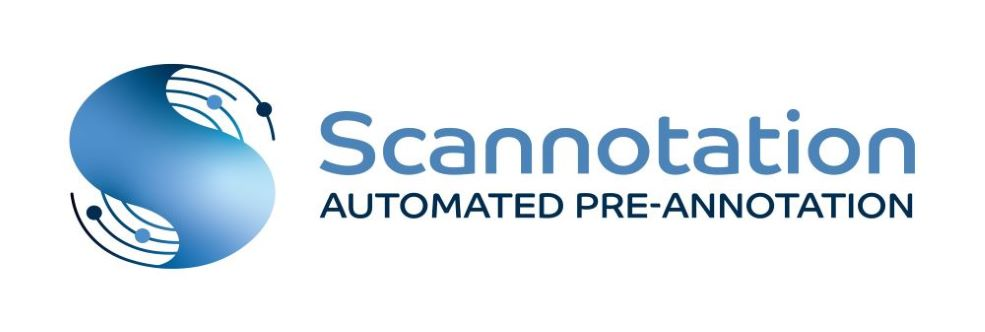
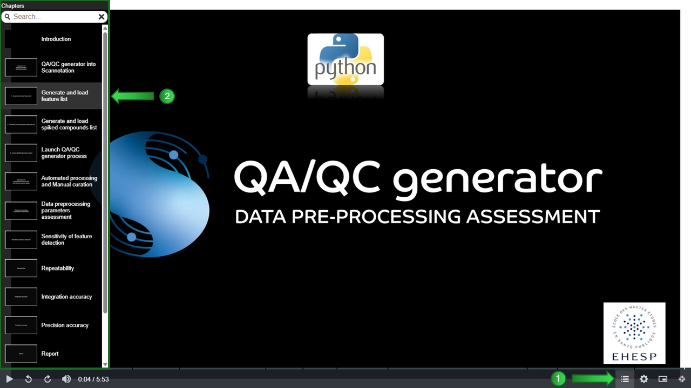

\
Scannotation is an automated and user-friendly suspect screening tool for the rapid pre-annotation of LC-HRMS datasets.\
This software is composed of three processes: Library, Screening and QA/QC generator.
> ### ➤&nbsp;&nbsp;Library and Screening processes:
> These processes combine several MS1 chemical predictors: m/z, retention times, isotopic patterns and neutral loss patterns, to score the proximity between features and suspects, thus efficiently prioritizing compounds of interest.

> ### ➤&nbsp;&nbsp;QA/QC generator process:
> This tool evaluates the completeness and robustness of MS1 HRMS data preprocessing.
> It produces harmonized PARC QA/QC preprocessing outputs and automatically generates a report based on the HBM4EU analytical QA/QC framework and additional project-specific criteria (for further details, please refer to: https://www.sciencedirect.com/science/article/abs/pii/S0165993624001560?via%3Dihub).

## Development
Scannotation was developed in Python 3.9 on Windows 11.

## Workflow description
For an overview of the complete Scannotation workflow, please download the file ["Scannotation_v4-workflow_description.zip"](https://github.com/scannotation/Scannotation_software_v4/blob/main/Scannotation_v4-workflow_description.zip) and launch in your web browser the file "Scannotation_v4-workflow_description_player.html" present in the zip file.

## Tutorials
To get started with **Scannotation**, you can view the video tutorial: please download the file ["Scannotation_v4-tutorial.zip"](https://github.com/scannotation/Scannotation_software_v4/blob/main/Scannotation_v4-tutorial.zip) and launch in your web browser the file "Scannotation_v4-tutorial_player.html" present in the zip file.

You may also refer to this [tutorial](https://github.com/scannotation/Scannotation_software/blob/master/Scannotation-tutorial.docx). It was created for previous Scannotation v3 release, but the main usage remains the same for the current version (which includes additional new features).

For more information about **QA/QC generator**, you can view the video tutorial:
* either [on YouTube](https://youtu.be/hOU8aIx0kSQ) directly
* or if you want to browse the video using the table of contents (recommended):\
\

\
\
&#x27AA; Please download the file ["QA-QC_generator-tutorial.zip"](https://github.com/scannotation/QA-QC_generator_software/blob/main/QA-QC_generator-tutorial.zip)
and launch in your web browser the file "QA-QC_generator-tutorial_player.html" present in the zip file.

## Publication
For more information, you can read the [article](https://doi.org/10.1021/acs.est.3c04764) about Scannotation published in "Environmental Science & Technology".\
The publications referencing Scannotation are available [on HAL](https://hal.science/search/index?q=scannotation).

## Teaser
A video introducing Scannotation is available [here](https://www.ehesp.fr/en/2023/11/30/chemical-exposome-ehesp-school-of-public-health-develops-and-releases-the-scannotation-open-access-software/).

## Help and Technical support
If you have any questions, please contact the developers at this address: scannotation@ehesp.fr or post your issue on this GitHub repository based on the file ["Issue_template.md"](Issue_template.md).
